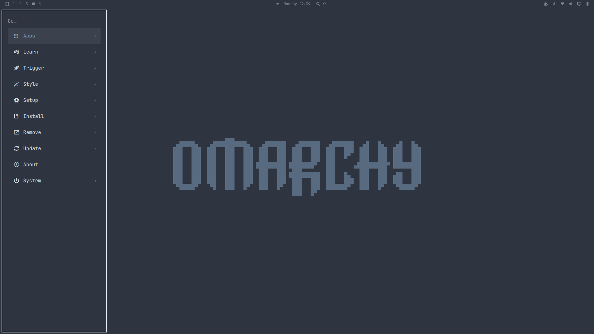

# ashley.menu

A restyled version of Omarchy's built-in app launcher/menu (`omarchy.menu`),
cloned via `omarchy plugin clone omarchy.menu`.



Changes from stock:

- **Docked left, full height** — the main nav menu sits flush against the
  left edge, just below the top bar, and fills the screen top to bottom
  instead of a small centered popup.
- **Slightly wider** — 340px instead of the stock 300px.
- **Slide in/out** — the menu slides in from the left edge on open and
  slides back out on close, instead of popping instantly.
- **Tighter row spacing** — reduced vertical gap between menu rows.

Dmenu-style popups (power menu, screenshot options, font picker, etc. —
anything opened via `omarchy-menu-select`/`omarchy-menu-input`) are
untouched and still open as small centered popups, since those are
short-lived scripted dialogs rather than the main launcher.

## Notes browser

Merged in from a separate `noteslauncher` plugin — a "Notes" row (just
above Setup) drops you into a browser for `~/Documents/notes/`:

- Lists every top-level folder under the notes root as a category
  (`jrnl/`, `notes/`, `recipes/`, and anything else you `mkdir` later —
  not hardcoded), most-recently-modified file first once you're inside one.
- `Tab` creates something — a new top-level category at the root, or a
  new note inside a category. Either way it pops open `notesAddInput`, a
  floating box centered on the whole screen (~35% of its width, resting
  about half an inch below the top edge) rather than the sidebar, so
  creating something never disturbs the list you're browsing. A typed
  note isn't written to disk until you save it in `nvim`, so backing out
  with `:q` leaves no trace — a folder is created immediately.
- `Enter`/`→` opens a file (in `nvim`, via `omarchy-launch-terminal`) or
  drills into a folder; `←`/`Backspace` drills back up; typing searches
  every file across every category at once; `Esc` clears the search, then
  backs out to the main menu.
- Edit `notesRoot` near the top of `Menu.qml` to point somewhere other
  than `~/Documents/notes`.

### Inbox / today's-journal scratchpads

`bin/notes-inbox-toggle` and `bin/jrnl-today-toggle` are also carried over
from noteslauncher unchanged — floating scratchpad terminals (Hyprland
special-workspace, same as the default `SUPER+S` scratchpad) editing a
fixed inbox note and today's journal entry respectively. Bind them in
`~/.config/hypr/bindings.lua`:

```lua
hl.unbind("SUPER + SHIFT + N")
o.bind("SUPER + SHIFT + N", "Notes", "omarchy-shell shell toggle ashley.menu '{\"menu\":\"notes\"}'")
o.bind("SUPER + N", "Notes inbox", os.getenv("HOME") .. "/.config/omarchy/plugins/ashley.menu/bin/notes-inbox-toggle")
o.bind("SUPER + D", "Today's journal", os.getenv("HOME") .. "/.config/omarchy/plugins/ashley.menu/bin/jrnl-today-toggle")
```

And in `~/.config/hypr/hyprland.lua` (window rules so the two scratchpads
float, center, and land on their own special workspace):

```lua
o.window("omarchy-notes-inbox", { tag = "+floating-window" })
o.window("omarchy-notes-inbox", { workspace = "special:notes-inbox" })
o.window("omarchy-jrnl-today", { tag = "+floating-window" })
o.window("omarchy-jrnl-today", { workspace = "special:jrnl-today" })
```

## Assumptions

This assumes a horizontal bar docked at the **top** of the screen
(`"bar": {"position": "top"}` in `~/.config/omarchy/shell.json`). If you
move the bar elsewhere, adjust `barThickness`/`dockTop` in `Menu.qml`
accordingly.

## Install

```bash
omarchy plugin add https://github.com/greenspotmail/omarchy-ashleymenu --enable
```

The "Notes" row itself is declared in `~/.config/omarchy/extensions/omarchy-menu.jsonc`
(shared user menu config, not part of this plugin folder), so a fresh
install elsewhere also needs this entry added there:

```jsonc
"notes": {"icon":"󰘙","label":"Notes","provider":"notes","aliases":["note","recipes","jrnl","journal"]},
```

`"provider":"notes"` is just a truthy marker so the row isn't hidden as an
"empty" submenu — it isn't a real registered provider; Menu.qml intercepts
selecting this row directly.

## Notes

After editing `Menu.qml`, Quickshell's plugin hot-reload doesn't always
pick up structural layout changes (only some property/logic edits apply
live). If a change doesn't seem to show up, run:

```bash
omarchy restart shell
```
